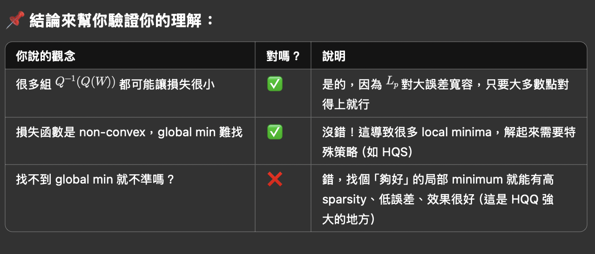
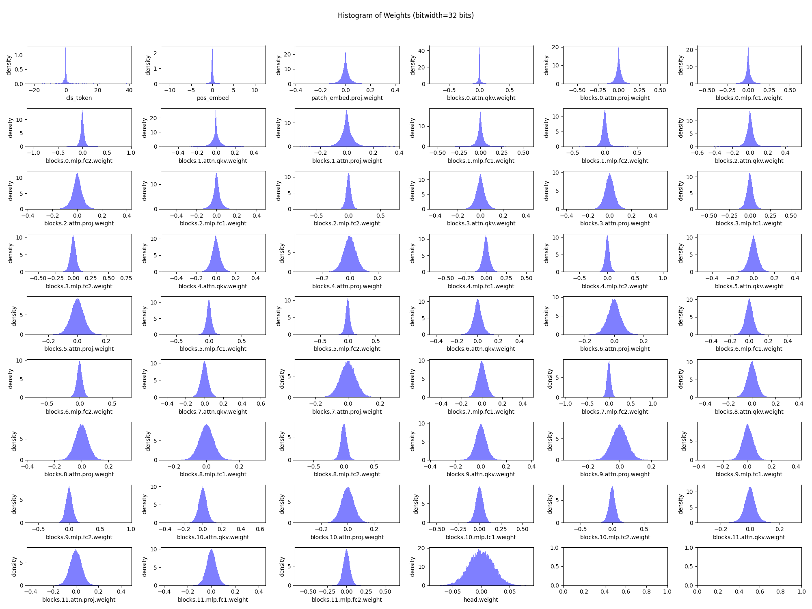

# Lab 2 Part 2: Model Quantization with HQQ
## 1. Half Quadratic Quantization Note
They use $L(p<1)Norm$ as error between $W$ & $Q^{-1}QW$ for promoting sparsity (This loss tolerate outlier while making most of error to 0).
Below explain why $L(p<1)Norm$ cause non-convex problem.

## 2. Analysis (40%)
### 2-1 Try to quantize DeiT-S from FP32 to nbit integer (n=8,4,3,2), fill in the following chart. (group_size=64) (10%)
| nbit | 32 | 8 | 4 | 3 | 2 |
|------|----|----|----|----|---|
| Accuracy (%) | 90.99 | 90.95% | 89.6% | 84.79% | 4.28% |
| Model Size (MiB) | 82.540 | 24.321 | 14.196 | 12.178 | 9.134 |

(8, 64, 90.95, 24.321182250976562, 12.678817749023438)
(8, 32, 90.95, 26.852432250976562, 10.147567749023438)
(8, 16, 90.99, 31.914932250976562, 5.0850677490234375)
(8, 8, 91.0, 42.03993225097656, -5.0399322509765625)
(4, 64, 89.6, 14.196182250976562, 18.80381774902338)
(4, 32, 89.81, 16.727432250976562, 18.37256774902346)
(4, 16, 90.13, 21.789932250976562, 15.210067749023438)
(4, 8, 90.47, 31.914932250976562, 5.0850677490234375)
(3, 64, 84.79, 12.177627563476562, -27.2776275634765)
(3, 32, 86.6, 14.705947875976562, -11.70594787597662)
(3, 16, 88.89, 19.766250610351562, 6.133749389648443)
(3, 8, 89.4, 29.890518188476562, 1.1094818115234943)
(2, 64, 4.28, 9.133682250976562, -829.3336822509766)
(2, 32, 20.93, 11.664932250976562, -665.3649322509765)
(2, 16, 57.35, 16.727432250976562, -306.22743225097656)
(2, 8, 81.78, 26.852432250976562, -72.05243225097655)

### 2-2 Try to quantize Llama3.2-1B-Instruct from FP16 to nbit integer (n=8,4,3,2), fill in the following chart. (group_size=64) (10%)
| nbit | 16 | 8 | 4 | 2 |
|------|----|----|----|----|
| Perplexity (PPL) | 13.160 | 13.168 | 15.051 | 215830.672 |
| Model Size (MiB) | 2858.129 | 1988.1337 | 1524.134 | 1292.134 |
| Throughput (toks/s) |  | 341.470 | 552.364 | 622.399 |

### 2-3 Explain how you determine the quantization method for DeiT-S and Llama3.2-1B-Instruct for best performance. If you can provide a visualized analysis or any chart according to your experiment would be better. (15%)

a. DeiT-S

I observed that the `attention` and `projection` layers have more uniform weight distributions, which allows us to use larger group sizes for quantization. As for the fully connected layers (`fc`), they don't affect accuracy as significantly, so I used fewer bits to quantize them while using smaller group sizes because their weight distributions contain more outliers.

b. Llama3.2-1B-Instruct

### 2-4 Which model is harder to quantize, what might be the reason ? (5%)

### 2-5 Please attach screenshots showing the speedup and PPL of Llama3.2-1B-Instruct in your report. The screenshot will be used as the evidence in case performance drops due to different hardware platform. (For Criteria of Section 2.2)